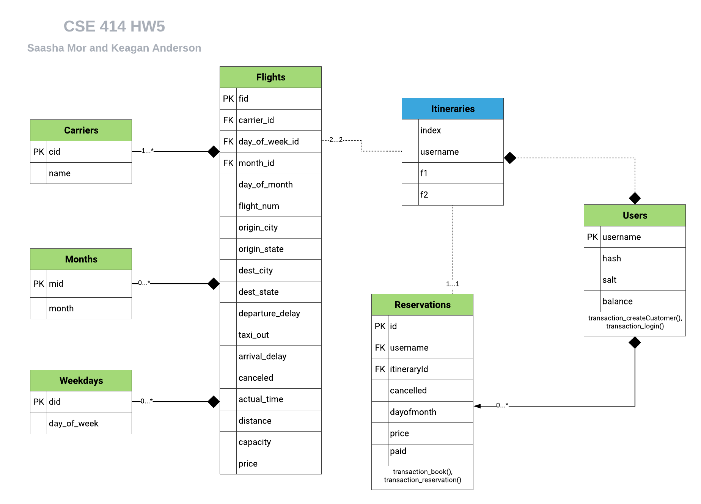

# Database Application and Transaction Management

**Objectives:**
To gain experience with database application development and transaction management.
To learn how to use SQL from within Java via JDBC.

**Tools Used:**
* [SQL Server](http://www.microsoft.com/sqlserver) through [SQL Azure](https://azure.microsoft.com/en-us/services/sql-database/)
* Maven (if using OSX, we recommend using Homebrew and installing with `brew install maven`)
* [Java 11 standard JDK](https://docs.oracle.com/en/java/javase/11/docs/api/index.html).

## Assignment Details

* Design a database of your customers and the flights they book
* Complete a working prototype of your flight booking application that connects to the database (in Azure) then allows customers to use a CLI (command line interface) to search, book, cancel, etc. flights


## Usage

```sh
$ mvn clean compile assembly:single
```

This second command will run the main method from `FlightService.java`, the interface logic for what you will implement in `Query.java`:

```sh
$ java -jar target/FlightApp-1.0-jar-with-dependencies.jar
```

If you want to run directly without creating the jar, you can run:

```sh
$ mvn compile exec:java
```

Sample UI:

```
*** Please enter one of the following commands ***
> create <username> <password> <initial amount>
> login <username> <password>
> search <origin city> <destination city> <direct> <day> <num itineraries>
> book <itinerary id>
> pay <reservation id>
> reservations
> cancel <reservation id>
> quit
```

### Data Model
You can read more about the thinking the design process refer to [this file](/design.md)


### Contributers
- Paul G. Allen School of Computer Science and Engineering, University of Washington (starter code)
- Keagan Anderson (kja@uw.edu)
