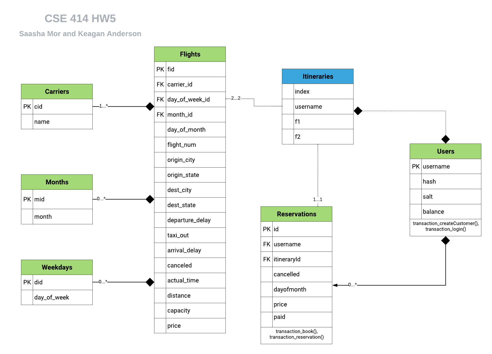

# Flights database UML design
**Saasha Mor and Keagan Anderson**
## UML

## Explanation of design
This database is designed to work around the `Flights`, `Carriers`, `Months` and `Weekdays` database.
- The database handles users using the `Users` table where the uniqueness of the username is ensured by using it as the primary key. The passwords are stored with a hash and a salt for encryption purposes.
- When the user searches for an itinerary, it is stored in the `Itineraries` _data structure_ with foreign key references to the `Flights` table with a maximum of two flights in an itinerary.

> **NOTE:** This table is not a table in the database, but is a temporary data structure.
This is done to ensure the searched Itineraries are specific to the user. To depict this in the UML, the entity is blue in color and it's relationships with other tables are depicted with dashed lines.

- The user can book their reservation which is stored in the `Reservations` table which gets a unique username as well as itinerary. Each user can have many reservations.

- The program has some inbuilt stored procedures to enforce the following constraints:
  - Users cannot book two flights on the same day
  - Users cannot create their session without an initial amount less than 0
  - Users cannot book flights if they don't have enough balance
---
I would also propose changing the `Flights` table slightly to make it less lengthy and reduce the amount of data stored by adding a table to store the state, city and delay of origin and departure. It would look something like this:

